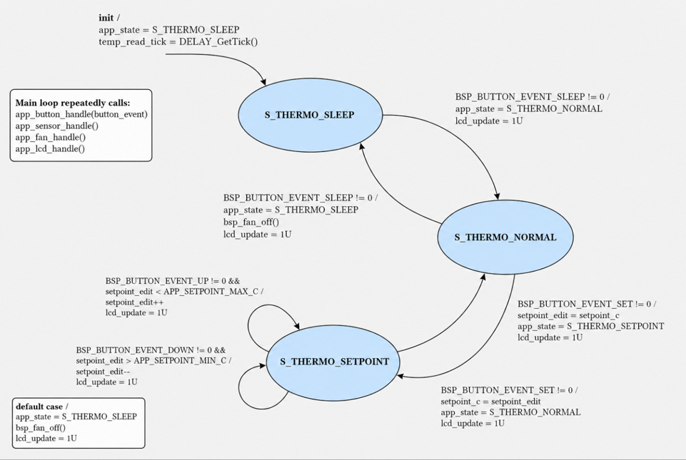
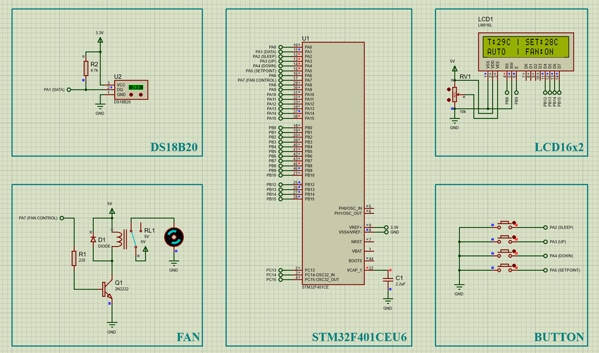

# Thermostat using STM32

This project implements a simple thermostat system using an STM32 microcontroller. The system reads temperature data from a DS18B20 sensor, displays the current temperature and setpoint on an LCD1602, and controls a cooling fan using an ON/OFF control algorithm.

The project was developed for the **Embedded System Programming** course and verified using **Proteus simulation**.

---

## 1. Project Overview

The thermostat monitors room temperature and controls a cooling fan based on a user-defined temperature setpoint.

Main behavior:

- Read temperature from a DS18B20 temperature sensor.
- Display current temperature, setpoint, operating mode, and fan status on LCD1602.
- Allow the user to adjust the setpoint using push buttons.
- Automatically turn the fan ON/OFF based on the temperature and setpoint.
- Provide Sleep, Normal, and Setpoint modes through a finite state machine.
- Verify the embedded software behavior in Proteus.

---

## 2. Main Features

- STM32-based embedded thermostat control.
- DS18B20 temperature measurement.
- LCD1602 display in 4-bit mode.
- Button-based user interface.
- ON/OFF fan control algorithm.
- Non-blocking temperature sampling design.
- Modular software architecture using Application, BSP, and Component Driver layers.
- Proteus simulation test cases for system verification.

---

## 3. System Requirements

### Functional Requirements

| ID | Requirement | Description |
|---|---|---|
| FR1 | Temperature measurement | Read room temperature from the DS18B20 sensor. |
| FR2 | Temperature display | Display temperature, setpoint, operating mode, and fan status on LCD1602. |
| FR3 | Setpoint adjustment | Allow the user to adjust the desired setpoint using push buttons. |
| FR4 | Fan control | Control the cooling fan automatically based on the setpoint. |

### Non-functional Requirements

| ID | Requirement | Description |
|---|---|---|
| NFR1 | Sampling period | Request a new temperature sample every 500 ms. |
| NFR2 | Temperature resolution | Display temperature with 1°C resolution. |
| NFR3 | Setpoint limitation | Limit the setpoint from 0°C to 70°C. |
| NFR4 | Safe operation | Keep the fan OFF during initialization, Sleep mode, and invalid sensor data. |

---

## 4. Hardware and Simulation Components

The system is simulated in Proteus and includes:

- STM32F401CEU6 microcontroller
- DS18B20 temperature sensor
- LCD1602 display
- Push buttons:
  - Sleep
  - Set
  - Up
  - Down
- Cooling fan output
- Relay/transistor driver circuit for fan control
- 3.3 V and 5 V power supply blocks

---

## 5. Project Structure

```text
thermostat_final/
├── Core/
├── Drivers/
├── Source/
│   ├── App/
│   │   ├── app_main.c
│   │   └── app_main.h
│   ├── BSP/
│   │   ├── bsp_button.c
│   │   ├── bsp_button.h
│   │   ├── bsp_ds18b20.c
│   │   ├── bsp_ds18b20.h
│   │   ├── bsp_fan.c
│   │   ├── bsp_fan.h
│   │   ├── bsp_lcd.c
│   │   └── bsp_lcd.h
│   └── Components/
│       ├── delay/
│       ├── ds18b20/
│       └── lcd1602/
├── thermostat_final.ioc
├── STM32F401CEUX_FLASH.ld
├── STM32F401CEUX_RAM.ld
├── .project
├── .cproject
└── .mxproject
```

---

## 6. Software Architecture

The software is organized into multiple layers.

| Layer | Location | Responsibility |
|---|---|---|
| Application Layer | `Source/App` | Thermostat behavior, FSM, control logic, LCD content |
| BSP Layer | `Source/BSP` | Hardware abstraction for buttons, fan, LCD, and DS18B20 |
| Component Driver Layer | `Source/Components` | Low-level reusable drivers for DS18B20, LCD1602, and delay |
| MCU/System Driver | `Core/`, `Drivers/` | STM32 peripheral initialization and HAL/LL drivers |

The application layer communicates with hardware through BSP APIs instead of directly accessing GPIO pins or low-level driver details. This improves readability, maintainability, and portability.

---

## 7. Important BSP APIs

| Module | API | Description |
|---|---|---|
| `bsp_button` | `bsp_button_init()` | Clears button event flags and resets debounce timestamps. |
| `bsp_button` | `bsp_button_get_events()` | Reads pending button events and clears them after reading. |
| `bsp_ds18b20` | `bsp_ds18b20_init()` | Initializes the DS18B20 interface. |
| `bsp_ds18b20` | `bsp_ds18b20_request_sample()` | Starts a new non-blocking temperature conversion. |
| `bsp_ds18b20` | `bsp_ds18b20_process()` | Processes the DS18B20 state machine. |
| `bsp_ds18b20` | `bsp_ds18b20_get_last_temp_int()` | Gets the latest integer Celsius temperature. |
| `bsp_lcd` | `bsp_lcd_init()` | Initializes the LCD1602 display. |
| `bsp_lcd` | `bsp_lcd_print_line()` | Prints a string to a selected LCD line. |
| `bsp_fan` | `bsp_fan_init()` | Initializes the fan output state. |
| `bsp_fan` | `bsp_fan_on()` | Turns the cooling fan ON. |
| `bsp_fan` | `bsp_fan_off()` | Turns the cooling fan OFF. |
| `bsp_fan` | `bsp_fan_is_on()` | Returns the current fan status. |

---

## 8. Application Flow

After system and peripheral initialization, the application initializes the delay module, button module, LCD module, fan module, and DS18B20 sensor.

The main application flow is:

1. Initialize delay function.
2. Initialize button, LCD, and fan BSP modules.
3. Set initial state to Sleep mode.
4. Set default setpoint to 28°C.
5. Turn the fan OFF for safety.
6. Initialize the DS18B20 sensor.
7. Request the first temperature sample if the sensor is ready.
8. Update the LCD for the first time.
9. Enter the main loop.
10. Repeatedly execute the thermostat FSM.

The main loop repeatedly calls:

```c
app_button_handle(button_event);
app_sensor_handle();
app_fan_handle();
app_lcd_handle();
```

---

## 9. Finite State Machine

The thermostat has three main states:

| State | Description | Fan Behavior |
|---|---|---|
| `S_THERMO_SLEEP` | Monitor-only mode. Temperature is displayed, but automatic cooling is disabled. | Fan forced OFF |
| `S_THERMO_NORMAL` | Normal thermostat mode. Temperature is compared with the setpoint. | Fan controlled automatically |
| `S_THERMO_SETPOINT` | Setpoint editing mode. User can change the setpoint using Up/Down buttons. | Fan control still active |

### State Transitions

| Current State | Button Event | Next State | Action |
|---|---|---|---|
| `S_THERMO_SLEEP` | Sleep | `S_THERMO_NORMAL` | Enable normal operation |
| `S_THERMO_NORMAL` | Sleep | `S_THERMO_SLEEP` | Turn fan OFF |
| `S_THERMO_NORMAL` | Set | `S_THERMO_SETPOINT` | Copy current setpoint to editable setpoint |
| `S_THERMO_SETPOINT` | Up | `S_THERMO_SETPOINT` | Increase editable setpoint if below maximum |
| `S_THERMO_SETPOINT` | Down | `S_THERMO_SETPOINT` | Decrease editable setpoint if above minimum |
| `S_THERMO_SETPOINT` | Set | `S_THERMO_NORMAL` | Save edited setpoint |
| Undefined case | Undefined | `S_THERMO_SLEEP` | Return to safe state and turn fan OFF |



---

## 10. Fan Control Algorithm

The thermostat uses a simple ON/OFF control algorithm.

The fan turns ON only when:

```text
current temperature > setpoint
```

The fan turns OFF when:

```text
current temperature <= setpoint
```

Additional safety conditions:

- The fan is forced OFF in Sleep mode.
- The fan is forced OFF when temperature data is invalid.
- The fan is OFF during initialization.

Simplified control logic:

```c
if ((app_state != S_THERMO_SLEEP) &&
    (current_temp_valid != 0U) &&
    (current_temp_c > setpoint_c)) {
    fan_should_on = 1U;
}
else {
    fan_should_on = 0U;
}
```

---

## 11. Timing Design

The application requests a new DS18B20 temperature sample every 500 ms.

```c
#define APP_TEMP_READ_PERIOD_MS 500U
```

The delay module provides timeout checking through:

```c
uint8_t DELAY_IsExpired(uint32_t start_tick, uint32_t delay_ms)
```

The temperature sensor process is designed in a non-blocking style. Instead of waiting inside a long delay during temperature conversion, the application requests a sample and continues running other tasks in the main loop.

---

## 12. LCD Display Format

| Mode | LCD Line 1 | LCD Line 2 |
|---|---|---|
| Sleep mode | `T:xxC | SLEEP` | `MONITOR ONLY` |
| Normal mode | `T:xxC | SET:xxC` | `AUTO | FAN:ON/OFF` |
| Setpoint mode | `T:xxC |>SET:xxC` | `UP/DN | SET=OK` |

If temperature data is invalid, the LCD displays:

```text
T:--C
```

---

## 13. Button Handling

The system uses four buttons:

| Button | Function |
|---|---|
| Sleep | Switch between Sleep mode and Normal mode |
| Set | Enter or confirm Setpoint mode |
| Up | Increase setpoint in Setpoint mode |
| Down | Decrease setpoint in Setpoint mode |

The button module uses event flags:

```c
#define BSP_BUTTON_EVENT_NONE  0U
#define BSP_BUTTON_EVENT_SLEEP (1U << 0)
#define BSP_BUTTON_EVENT_UP    (1U << 1)
#define BSP_BUTTON_EVENT_DOWN  (1U << 2)
#define BSP_BUTTON_EVENT_SET   (1U << 3)
```

A debounce time is applied to reduce false triggers caused by mechanical button bouncing.

```c
#define BSP_BUTTON_DEBOUNCE_MS 100U
```

---

## 14. Build and Run

### Requirements

- STM32CubeIDE
- STM32CubeMX project file `.ioc`
- Proteus for simulation
- STM32F4 firmware package
- ARM GCC toolchain, usually included with STM32CubeIDE

### Steps

1. Clone this repository:

```bash
git clone https://github.com/NguyenTran-88/Thermostat-using-STM32.git
```

2. Open STM32CubeIDE.

3. Import the project:

```text
File > Import > Existing Projects into Workspace
```

4. Select the cloned project folder.

5. Build the project.

6. Load the generated firmware file into the STM32 model in Proteus.

7. Run the Proteus simulation.

---

## 15. Proteus Simulation Test Cases

| Test Case | Condition | Expected Result | Result |
|---|---|---|---|
| TC01 | System starts | LCD shows initial state | Pass |
| TC02 | Temperature changes | LCD updates current temperature | Pass |
| TC03 | Temperature > setpoint | Fan turns ON | Pass |
| TC04 | Temperature <= setpoint | Fan turns OFF | Pass |
| TC05 | Up button pressed | Setpoint increases by 1°C | Pass |
| TC06 | Down button pressed | Setpoint decreases by 1°C | Pass |
| TC07 | Set button pressed | System enters or exits Setpoint mode | Pass |
| TC08 | Sleep button pressed | System changes between Normal and Sleep mode | Pass |


---

## 16. Limitations

Although the system works correctly in Proteus simulation, there are still some limitations:

- The project was verified only in simulation, not on real hardware.
- Real hardware issues such as electrical noise, unstable power supply, GPIO signal quality, and wiring problems were not fully evaluated.
- The fan control uses a simple ON/OFF algorithm without hysteresis.
- If the temperature fluctuates around the setpoint, the fan may turn ON and OFF frequently.
- The setpoint is not stored in non-volatile memory, so it returns to the default value after reset or power loss.

---

## 17. Future Improvements

Possible improvements include:

- Add hysteresis control to prevent frequent fan switching near the setpoint.
- Store the user-defined setpoint in Flash memory or EEPROM.
- Add PWM fan speed control.
- Add sensor error display on the LCD.
- Add UART debugging messages.
- Verify the system on real hardware.
- Improve the user interface with more display modes or alarm messages.

---

## 18. Reference

- nimaltd, “Non-blocking DS18B20 Library for STM32,” GitHub.  
  Available: https://github.com/nimaltd/ds18b20
